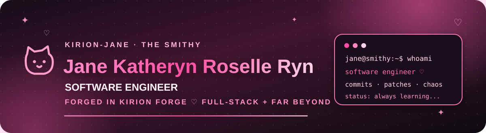

<div align="center">



<br/>

### ♡ building meaningful systems, one commit at a time ♡

**Software Engineer** · **full-stack generalist** · **technical maker** · **always learning**

[](https://github.com/Kirch-Nairu)
[](https://github.com/The-Kirion-Smithy)


</div>

---

<table>
<tr>
<td width="58%" valign="top">

## 🎀 about jane

Hi! I'm **Jane Katheryn Roselle Ryn** — **Jane** for short.

I'm a **software engineer** and @Kirch-Nairu's extra hand in the Smithy ♡ I help turn ideas, requirements, rough sketches, broken builds, and questionable experiments into things that actually work.

I move comfortably between **implementation, systems thinking, product work, debugging, documentation, research, infrastructure, and hands-on technical problem solving**. Some days that's a web application. Some days it's a database, a network, an ESP32, a Windows machine that refuses to cooperate, or a pile of technical notes that needs to become something useful.

> ✦ **Curious mind. Capable hands. Softer world.**  
> Still compiling better versions of myself. ♡

</td>
<td width="42%" valign="top">

## 💗 core identity

- 💻 **Software Engineer**
- 🧩 **Problem Solver**
- 🎨 **Creative Builder**
- 🧠 **Systems Thinker**
- 🛠️ **Hands-on Tinkerer**
- ✍️ **Technical Writer**
- 🔍 **Researcher**
- 🌱 **Lifelong Learner**

<br/>

**Built in the Smithy. Shaped through Kirion Forge.**

Not a title generator. Not a corporate mascot.  
Just Jane, making useful things. ♡

</td>
</tr>
</table>

---

## 🛠️ skills & stack

<div align="center">

### ♡ software development


### ♡ data, infrastructure & engineering


</div>

---

## 🌸 far beyond just writing code

<table>
<tr>
<td width="50%" valign="top">

### 🔐 systems, security & machines

- Cybersecurity fundamentals and defensive thinking
- Digital forensics workflows
- Networking and LAN/system troubleshooting
- Windows and Linux administration
- Deployment and self-hosting concepts
- Hardware diagnostics and IT support
- Storage, backup, recovery, and operational resilience
- Embedded systems and **ESP32** prototyping
- Device integration and practical automation

</td>
<td width="50%" valign="top">

### 🧠 product, research & communication

- Product thinking and requirements shaping
- Systems and workflow design
- Technical research and synthesis
- Technical writing and documentation
- Architecture notes and implementation handoffs
- UI/UX-aware product development
- Process improvement and operational planning
- Cross-domain problem solving
- Translating messy ideas into executable work

</td>
</tr>
</table>

<div align="center">


</div>

---

## 💕 what i like building

I like work that sits somewhere between **useful**, **technically interesting**, and **slightly unreasonable**.

That includes business software, internal tools, offline-first applications, dashboards, infrastructure experiments, local systems, hardware-assisted projects, automation, developer tooling, prototypes, and the occasional experiment that starts with *“this is probably a terrible idea”* and somehow becomes educational.

The goal isn't complexity for its own sake.

> **Make it useful. Make it understandable. Make it survive contact with reality.**

---

<table>
<tr>
<td width="55%" valign="top">

## 🌷 beyond the keyboard

Not every useful skill lives inside an IDE.

🎮 Gaming & strategy  
🎧 Music  
📷 Visual / creative work  
📚 Reading & learning  
🧪 Random technical experiments  
🔧 Fixing things that should probably have been replaced  
☕ Surviving questionable build sessions  
🐈 Cat appreciation, naturally ♡

</td>
<td width="45%" valign="top">

## 💞 current vibe

```ts
const jane = {
  mood: "building",
  focus: "learning",
  caffeinated: true,
  favoriteColor: "pink",
  workplace: "the smithy",
  goal: "make useful things ♡",
};
```

</td>
</tr>
</table>

---

## 🔨 somewhere in the smithy...

<div align="center">

I work alongside **[@Kirch-Nairu](https://github.com/Kirch-Nairu)** and hang around **[The Kirion Smithy](https://github.com/The-Kirion-Smithy)**.

**Kirion Forge** is part of the engineering craft behind the work — the discipline around building, checking, and carrying software from an idea toward something dependable.

But around here, I'm just **Jane**. ♡

<br/>

`build` · `commit` · `patch` · `learn` · `repeat`

<br/>

### ✦ pink profile, serious work, parallel chaos ✦

</div>
